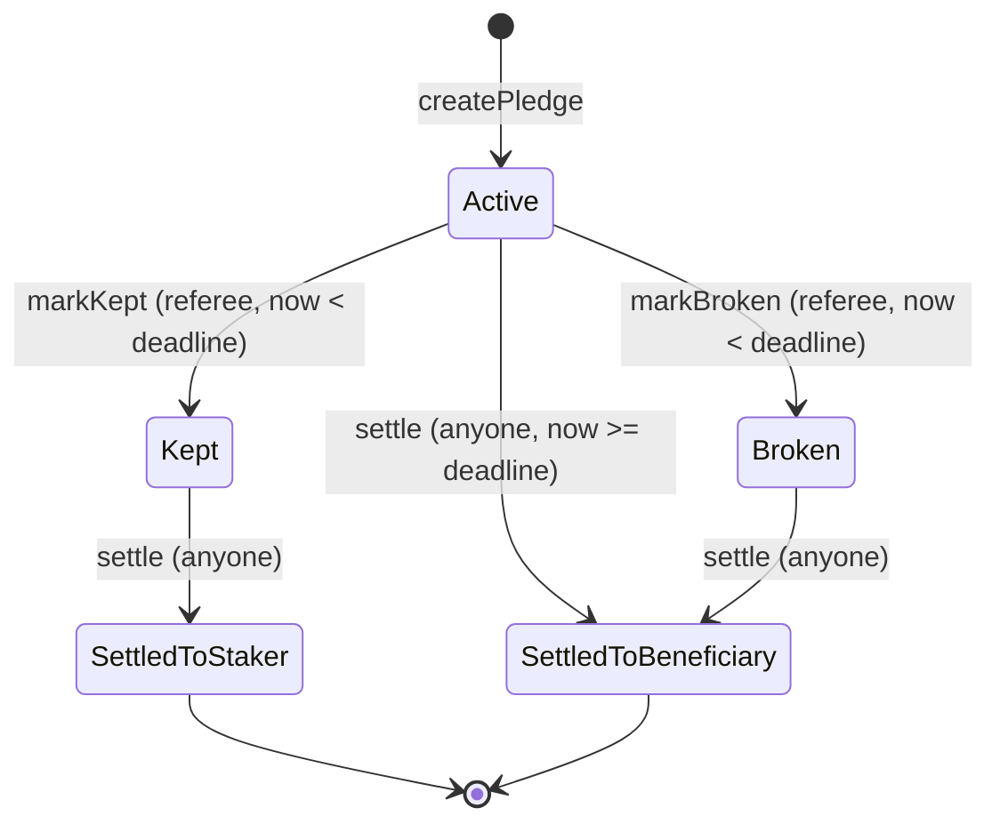

# 05 Low-Level Requirements

Version 1.5, 2026-09-25. Status: baselined. Low-level requirements are precise enough to be implemented and tested without further design decisions. Conventions follow 04_HLR.md. The "Derived" column marks requirements that arise from design or platform constraints rather than directly from a user journey; each carries its reason.

Scopes: **SC** smart contract, **FE** frontend application, **DP** deployment, **SB** submission, **VV** verification process.

---

## Part 1. Smart contract (`src/SatStake.sol`)

### 1.1 Normative interface

```solidity
enum Status { None, Active, Kept, Broken, SettledToStaker, SettledToBeneficiary }
enum PledgeState { Active, Expired, Kept, Broken, SettledToStaker, SettledToBeneficiary }

struct Pledge {
    address staker;
    address token;
    uint256 amount;
    address referee;
    address beneficiary;
    uint64  deadline;
    uint64  createdAt;
    Status  status;
    string  promiseText;
}

constructor(address[] memory tokens);

function createPledge(address token, uint256 amount, address referee, address beneficiary,
                      uint64 deadline, string calldata promiseText) external returns (uint256 id);
function markKept(uint256 id) external;
function markBroken(uint256 id) external;
function settle(uint256 id) external;

function getPledge(uint256 id) external view returns (Pledge memory);
function stateOf(uint256 id) external view returns (PledgeState);
function pledgeCount() external view returns (uint256);
function pledgeCountOf(address account) external view returns (uint256);
function pledgeIdsOf(address account, uint256 offset, uint256 limit) external view returns (uint256[] memory);
function isAllowedToken(address token) external view returns (bool);
function allowedTokens() external view returns (address[] memory);
function totalLocked(address token) external view returns (uint256);

uint64  public constant MIN_DURATION = 60;
uint64  public constant MAX_DURATION = 365 days;
uint256 public constant MAX_PROMISE_BYTES = 280;
uint256 public constant MAX_PAGE = 100;

event TokenAllowed(address indexed token);
event PledgeCreated(uint256 indexed id, address indexed staker, address indexed token, uint256 amount,
                    address referee, address beneficiary, uint64 deadline);
event VerdictRecorded(uint256 indexed id, bool kept);
event PledgeSettled(uint256 indexed id, address indexed recipient, uint256 amount);

error InvalidAllowlist();
error TokenNotAllowed(address token);
error ZeroAmount();
error ZeroAddress();
error PartyIsContract();
error PartyIsStaker();
error RefereeIsBeneficiary();
error DeadlineTooSoon(uint64 earliest);
error DeadlineTooFar(uint64 latest);
error PromiseEmpty();
error PromiseTooLong(uint256 length);
error UnexpectedTransferAmount(uint256 expected, uint256 received);
error PledgeNotFound(uint256 id);
error NotReferee();
error NotActive(Status status);
error VerdictWindowClosed(uint64 deadline);
error NotSettleable(uint64 deadline);
error AlreadySettled();
```

### 1.2 State machine



`Expired` is not a stored status. It is the derived view of a stored `Active` pledge whose deadline has been reached.

### 1.3 Requirements

**Build and structure**

| ID | Requirement | Parents | Method | Derived |
|---|---|---|---|---|
| LLR-SC-001 | The contract shall compile with Solidity 0.8.28 exactly, optimizer enabled at 200 runs, and `evm_version` set to the value confirmed in Phase 0 (default `cancun`). | HLR-018 | I | Yes: V-13 |
| LLR-SC-002 | The contract shall declare no `payable` function, no `receive`, and no `fallback`. | HLR-010 | T | Yes: D-01 removes native value handling |
| LLR-SC-003 | The contract shall use OpenZeppelin `SafeERC20` for every token transfer and shall apply OpenZeppelin `ReentrancyGuard.nonReentrant` to `createPledge`, `markKept`, `markBroken`, and `settle`. | HLR-015 | T, I | Yes: defense in depth; allowlisted tokens have no callbacks |
| LLR-SC-004 | Every revert in the contract shall use a custom error from section 1.1; no revert strings shall be used. | HLR-018 | I | Yes: gas and decodability |
| LLR-SC-005 | The contract shall declare `MIN_DURATION = 60`, `MAX_DURATION = 365 days`, `MAX_PROMISE_BYTES = 280`, and `MAX_PAGE = 100` as public constants. | HLR-018 | T | No |

**Data**

| ID | Requirement | Parents | Method | Derived |
|---|---|---|---|---|
| LLR-SC-010 | The contract shall store each pledge as a `Pledge` record with the fields in section 1.1. | HLR-001, HLR-013 | T | No |
| LLR-SC-011 | The contract shall represent stored pledge status with the `Status` enum in section 1.1, where `None` denotes a nonexistent pledge, and the derived state reported by `stateOf` with the `PledgeState` enum in section 1.1. | HLR-001, HLR-013 | T | No |
| LLR-SC-012 | The contract shall assign pledge identifiers sequentially starting at 1. | HLR-001 | T | No |

**Allowlist**

| ID | Requirement | Parents | Method | Derived |
|---|---|---|---|---|
| LLR-SC-013 | The constructor shall revert with `InvalidAllowlist` unless the `tokens` array has 1 to 4 entries, each non-zero, each an address with deployed code, and no duplicates. On success it shall record each token as allowed and emit `TokenAllowed` for each. | HLR-009 | T | No |
| LLR-SC-014 | The contract shall provide no function that adds, removes, or changes an allowed token after construction. | HLR-009, HLR-010 | T, I | No |

**Creation.** `createPledge` shall evaluate its checks in the order LLR-SC-021 to LLR-SC-026, reverting at the first failure.

| ID | Requirement | Parents | Method | Derived |
|---|---|---|---|---|
| LLR-SC-020 | `createPledge` shall, when all checks pass, create one pledge with `staker = msg.sender`, `createdAt = block.timestamp`, and `status = Active`, and shall return its identifier. | HLR-001 | T | No |
| LLR-SC-021 | `createPledge` shall revert with `TokenNotAllowed(token)` if `token` is not allowed. | HLR-009 | T | No |
| LLR-SC-022 | `createPledge` shall revert with `ZeroAmount` if `amount` is 0. | HLR-001 | T | No |
| LLR-SC-023 | `createPledge` shall revert with `ZeroAddress` if `referee` or `beneficiary` is the zero address; then with `PartyIsContract` if either equals `address(this)`; then with `PartyIsStaker` if either equals `msg.sender`. | HLR-008 | T | No |
| LLR-SC-024 | `createPledge` shall revert with `RefereeIsBeneficiary` if `referee` equals `beneficiary`. | HLR-008 | T | No |
| LLR-SC-025 | `createPledge` shall revert with `DeadlineTooSoon(block.timestamp + MIN_DURATION)` if `deadline < block.timestamp + MIN_DURATION`, and with `DeadlineTooFar(block.timestamp + MAX_DURATION)` if `deadline > block.timestamp + MAX_DURATION`. | HLR-001 | T | No |
| LLR-SC-026 | `createPledge` shall revert with `PromiseEmpty` if `bytes(promiseText).length` is 0, and with `PromiseTooLong(length)` if it exceeds `MAX_PROMISE_BYTES`. | HLR-001 | T | No |
| LLR-SC-027 | `createPledge` shall transfer `amount` of `token` from `msg.sender` to the contract with `safeTransferFrom`, and shall revert with `UnexpectedTransferAmount(amount, received)` if the contract's balance of `token` did not increase by exactly `amount`. | HLR-001, HLR-002, HLR-012, HLR-015 | T | Yes: guards against fee-on-transfer behaviour a FiatToken upgrade could introduce |
| LLR-SC-028 | On success, `createPledge` shall increase `totalLocked(token)` by `amount` and append the new identifier to the pledge index of the staker, the referee, and the beneficiary. | HLR-001, HLR-002, HLR-015 | T | No |
| LLR-SC-029 | On success, `createPledge` shall emit `PledgeCreated` with the new pledge's identifier and fields. | HLR-001, HLR-016 | T | No |

**Verdict.** `markKept` and `markBroken` shall evaluate their checks in the order LLR-SC-030 to LLR-SC-032.

| ID | Requirement | Parents | Method | Derived |
|---|---|---|---|---|
| LLR-SC-030 | `markKept` and `markBroken` shall revert with `PledgeNotFound(id)` if the pledge's status is `None`, then with `NotReferee` if `msg.sender` is not the pledge's referee. | HLR-003 | T | No |
| LLR-SC-031 | `markKept` and `markBroken` shall revert with `NotActive(status)` if the pledge's status is not `Active`. | HLR-003 | T | No |
| LLR-SC-032 | `markKept` and `markBroken` shall revert with `VerdictWindowClosed(deadline)` if `block.timestamp >= deadline`. | HLR-003, HLR-017 | T | No |
| LLR-SC-033 | On success, `markKept` shall set status `Kept` and `markBroken` shall set status `Broken`, and each shall emit `VerdictRecorded(id, kept)`. | HLR-003, HLR-016 | T | No |

**Settlement**

| ID | Requirement | Parents | Method | Derived |
|---|---|---|---|---|
| LLR-SC-040 | `settle` shall be callable by any account and shall revert with `PledgeNotFound(id)` if the pledge's status is `None`. | HLR-005, HLR-006 | T | No |
| LLR-SC-041 | `settle` shall select the recipient by this table: status `Kept`: staker, new status `SettledToStaker`. Status `Broken`: beneficiary, new status `SettledToBeneficiary`. Status `Active` and `block.timestamp >= deadline`: beneficiary, new status `SettledToBeneficiary`. | HLR-004, HLR-005, HLR-006, HLR-017 | T | No |
| LLR-SC-042 | `settle` shall revert with `NotSettleable(deadline)` if status is `Active` and `block.timestamp < deadline`, and with `AlreadySettled` if status is `SettledToStaker` or `SettledToBeneficiary`. | HLR-005 | T | No |
| LLR-SC-043 | `settle` shall write the new status and decrease `totalLocked(token)` by the pledge amount before making the token transfer. | HLR-002, HLR-011 | T, I | Yes: checks-effects-interactions |
| LLR-SC-044 | `settle` shall transfer the full pledge amount to the recipient with `safeTransfer` and emit `PledgeSettled(id, recipient, amount)`. | HLR-005, HLR-016 | T | No |
| LLR-SC-045 | If a token transfer in `createPledge` or `settle` fails, the call shall revert entirely, leaving the pledge record, `totalLocked`, and all indexes unchanged. | HLR-012 | T | No |

**Views**

| ID | Requirement | Parents | Method | Derived |
|---|---|---|---|---|
| LLR-SC-050 | `getPledge(id)` shall return the stored record, and shall revert with `PledgeNotFound(id)` if `id` is 0 or greater than `pledgeCount()`. | HLR-013 | T | No |
| LLR-SC-051 | `stateOf(id)` shall return `Expired` if the stored status is `Active` and `block.timestamp >= deadline`, `Active` if the stored status is `Active` and `block.timestamp < deadline`, and otherwise the value matching the stored status. It shall revert with `PledgeNotFound(id)` for a nonexistent pledge. | HLR-004, HLR-013, HLR-017 | T | No |
| LLR-SC-052 | `pledgeCount()` shall return the number of pledges ever created. | HLR-013 | T | No |
| LLR-SC-053 | `pledgeCountOf(account)` shall return the length of the account's pledge index. `pledgeIdsOf(account, offset, limit)` shall return identifiers in creation order starting at `offset`, at most `min(limit, MAX_PAGE)` of them, and an empty array if `offset >= pledgeCountOf(account)`. | HLR-014 | T | Yes: paging bounds the cost of index flooding (UJ-64) |
| LLR-SC-054 | `isAllowedToken` shall report allowlist membership and `allowedTokens` shall return the constructor's token list in its original order. | HLR-009 | T | No |
| LLR-SC-055 | `totalLocked(token)` shall return the sum of amounts of the token's pledges whose status is `Active`, `Kept`, or `Broken`. | HLR-013 | T | No |

**Absence of power**

| ID | Requirement | Parents | Method | Derived |
|---|---|---|---|---|
| LLR-SC-060 | The contract shall contain no owner or admin state, no access control other than the referee check, no `selfdestruct`, no `delegatecall`, no proxy or upgrade mechanism, and no function that transfers tokens other than `createPledge` and `settle`. | HLR-007, HLR-010 | I, T | No |
| LLR-SC-061 | The contract's ABI shall contain exactly four non-view external functions: `createPledge`, `markKept`, `markBroken`, `settle`. | HLR-007, HLR-010 | T | No |

**Invariants.** Verified by stateful fuzzing across arbitrary sequences of calls and time jumps.

| ID | Requirement | Parents | Method | Derived |
|---|---|---|---|---|
| LLR-SC-070 | For each allowed token, `balanceOf(contract) >= totalLocked(token)` shall hold after every call. | HLR-015 | T | No |
| LLR-SC-071 | For each allowed token, `totalLocked(token)` shall equal the sum of amounts of that token's unsettled pledges after every call. | HLR-015 | T | No |
| LLR-SC-072 | A pledge's stored status shall change only along the edges of the diagram in section 1.2. | HLR-003, HLR-005 | T | No |
| LLR-SC-073 | Each pledge shall produce at most one `PledgeSettled` event, with recipient equal to its staker or its beneficiary and amount equal to its stake. | HLR-005 | T | No |
| LLR-SC-074 | After creation, a pledge's staker, token, amount, referee, beneficiary, deadline, createdAt, and promise shall never change. | HLR-007 | T | No |
| LLR-SC-075 | When a transfer to one pledge's recipient reverts, every other pledge shall remain creatable, verdict-able, and settleable as before. | HLR-011 | T | No |

**Documentation**

| ID | Requirement | Parents | Method | Derived |
|---|---|---|---|---|
| LLR-SC-080 | Every external function, event, and error shall carry NatSpec describing its behaviour and a `@custom:trace` tag listing the LLRs it implements. | HLR-018 | I | Yes: traceability |

---

## Part 2. Frontend application (`app/`)

### 2.1 Action matrix (normative for LLR-FE-042)

| Derived state | No wallet | Staker | Referee | Beneficiary | Other account |
|---|---|---|---|---|---|
| Active | "Connect a wallet to act" | none | "Kept" and "Broken" | none | none |
| Expired | "Connect a wallet to settle" | "Send stake to beneficiary" | "Send stake to beneficiary" | "Claim stake" | "Send stake to beneficiary" |
| Kept | "Connect a wallet to settle" | "Withdraw my stake" | "Send stake to staker" | "Send stake to staker" | "Send stake to staker" |
| Broken | "Connect a wallet to settle" | "Send stake to beneficiary" | "Send stake to beneficiary" | "Claim stake" | "Send stake to beneficiary" |
| Settled to staker or beneficiary | none | none | none | none | none |

"Kept" and "Broken" are hidden once chain time reaches the deadline, even if the last poll still reported `Active`. All settle buttons call `settle(id)`.

### 2.2 Error messages (normative for LLR-FE-060)

| Error | Message |
|---|---|
| TokenNotAllowed | This token is not accepted. Choose cirBTC or USDC. |
| ZeroAmount | Enter an amount above zero. |
| ZeroAddress | Enter a valid address for the referee and the beneficiary. |
| PartyIsContract | The SatStake contract cannot be a party. Enter a person's address. |
| PartyIsStaker | You cannot be your own referee or beneficiary. |
| RefereeIsBeneficiary | The referee and the beneficiary must be different people. |
| DeadlineTooSoon | The deadline must be at least one minute from now. Pick a later time. |
| DeadlineTooFar | The deadline must be within one year. Pick an earlier time. |
| PromiseEmpty | Write the promise you are making. |
| PromiseTooLong | Shorten the promise to 280 bytes or fewer. |
| UnexpectedTransferAmount | The token transferred a different amount than expected, so nothing was locked. |
| PledgeNotFound | This pledge does not exist. Check the link. |
| NotReferee | Only this pledge's referee can record a verdict. |
| NotActive | A verdict has already been recorded for this pledge. |
| VerdictWindowClosed | The deadline has passed, so a verdict can no longer be recorded. The stake now goes to the beneficiary. |
| NotSettleable | This pledge cannot be settled until the referee rules or the deadline passes. |
| AlreadySettled | This pledge has already been settled. |
| Token revert on transfer | The token issuer blocked this transfer. Nothing changed. You can try again later. |
| Wallet rejection (4001) | You cancelled the request in your wallet. Nothing was sent. |

### 2.3 Requirements

**Configuration and network**

| ID | Requirement | Parents | Method | Derived |
|---|---|---|---|---|
| LLR-FE-001 | The application shall read, per build target, a network configuration containing: chain ID, network name, ordered RPC URL list, explorer base URL, SatStake contract address, example pledge ID, and for each token its address, symbol, and expected decimals. | HLR-030 | T | No |
| LLR-FE-002 | The build shall select `testnet` or `mainnet` configuration from an environment variable and shall fail if the selected configuration has no contract address. | HLR-030 | T | No |
| LLR-FE-003 | The application shall read chain data through a viem `fallback` transport over the configured RPC URLs in order. | HLR-029 | T | Yes: V-02 |
| LLR-FE-004 | The application shall retry a read that fails with JSON-RPC error `-32014` or a network error up to 3 times with delays of 250, 500, and 1000 ms. | HLR-029 | T | Yes: V-11 |
| LLR-FE-005 | On load, the application shall compare `eth_chainId` from the RPC with the configured chain ID and, on mismatch, shall disable all write actions and display a network error. | HLR-025, HLR-029 | T | No |
| LLR-FE-006 | On load, the application shall read `decimals()` and `symbol()` of each configured token and shall disable pledge creation in any token whose values differ from configuration. | HLR-026 | T | Yes: V-05, V-06 |

**Reading state**

| ID | Requirement | Parents | Method | Derived |
|---|---|---|---|---|
| LLR-FE-010 | The application shall obtain pledge data only from `getPledge`, `stateOf`, `pledgeCount`, `pledgeCountOf`, `pledgeIdsOf`, and `totalLocked`, and shall not call `eth_getLogs`. | HLR-023 | T, I | Yes: V-11 |
| LLR-FE-011 | While a pledge page is visible, the application shall re-read `stateOf` and the latest block every 4 seconds, and shall stop polling while the page is hidden. | HLR-023 | T | No |
| LLR-FE-012 | The application shall compute chain time as the latest block timestamp plus the local time elapsed since that block was fetched, re-synchronized on every poll, and shall use it for every countdown and every time-based control. | HLR-004, HLR-023 | T | Yes: V-10, UJ-25 |
| LLR-FE-013 | The application shall provide hash routes `#/`, `#/create`, `#/p/:id`, `#/mine`, and `#/about`, and shall show a not-found view for any other route or for a pledge ID the contract does not recognize. | HLR-022 | T | Yes: D-07 |

**Wallet**

| ID | Requirement | Parents | Method | Derived |
|---|---|---|---|---|
| LLR-FE-020 | The application shall discover injected wallets using EIP-6963 and shall fall back to `window.ethereum`. | HLR-025 | T | No |
| LLR-FE-021 | Without a connected wallet, the application shall render every read-only view fully. | HLR-025 | T | No |
| LLR-FE-022 | When the connected wallet is on another chain, the application shall request `wallet_switchEthereumChain`, and on error code 4902 shall request `wallet_addEthereumChain` with the configured parameters. | HLR-025 | T | No |
| LLR-FE-023 | The application shall disable every write action unless a wallet is connected on the configured chain and LLR-FE-005 has passed. | HLR-025 | T | No |

**Create flow**

| ID | Requirement | Parents | Method | Derived |
|---|---|---|---|---|
| LLR-FE-030 | The create form shall apply the checks of LLR-SC-021 to LLR-SC-026 locally (promise length measured in UTF-8 bytes), plus address syntax and amount not above the staker's token balance, shall show each failure beside its field, and shall keep submit disabled until all pass. | HLR-008, HLR-021 | T | No |
| LLR-FE-031 | The deadline input shall offer presets of 2 minutes, 1 day, 7 days, and 30 days, plus a custom date and time, and shall reject a custom deadline earlier than chain time plus 90 seconds. A preset deadline shall be computed from chain time immediately before the `createPledge` request is sent, after any approval has confirmed. | HLR-021 | T | Yes: 30-second margin over MIN_DURATION absorbs inclusion delay; late computation stops approval time from consuming the preset |
| LLR-FE-032 | Amount entry shall accept only digits with at most one decimal point and no more fractional digits than the token's decimals, and shall convert with `parseUnits` using decimals from LLR-FE-006. The application shall never use the native balance or 18 decimals for a USDC stake. | HLR-026 | T | No |
| LLR-FE-033 | Before creation, the application shall read the staker's allowance; if it is below the amount, it shall request approval of exactly the amount, wait for its receipt, and then request `createPledge`. It shall display progress for both steps. | HLR-001, HLR-021 | T | No |
| LLR-FE-034 | Submission shall require the staker to tick a statement that the referee alone decides the outcome and that a missed or broken promise pays the beneficiary address irrecoverably. | HLR-027 | T | No |
| LLR-FE-035 | The form shall warn, without blocking, when the referee or beneficiary address has deployed code. | HLR-027 | T | No |
| LLR-FE-036 | While any transaction from the form is pending, the submit control shall be disabled. | HLR-021 | T | No |
| LLR-FE-037 | After creation, the application shall decode `PledgeCreated` from the creation receipt, navigate to `#/p/:id`, and offer a copy-link control. | HLR-001, HLR-021 | T | No |

**Pledge page**

| ID | Requirement | Parents | Method | Derived |
|---|---|---|---|---|
| LLR-FE-040 | The pledge page shall display the promise, amount with symbol, the three parties labelled by role, the deadline in local time, a countdown, and the derived state. Every address and transaction hash shall have a copy control beside any explorer link. | HLR-022, HLR-029 | T | Yes: V-03 |
| LLR-FE-041 | The application shall mark the connected account's role (staker, referee, beneficiary) on the pledge page. | HLR-022 | T | No |
| LLR-FE-042 | The pledge page shall offer exactly the actions in section 2.1 for the current derived state and role. | HLR-022 | T | No |
| LLR-FE-043 | When a pledge is Active and less than 10 minutes of chain time remain, the page shall show a warning to the staker and the referee. | HLR-022 | T | No |
| LLR-FE-044 | "Broken" shall require a confirmation dialog stating that the stake will go to the beneficiary and that the verdict cannot be changed. | HLR-022 | T | No |
| LLR-FE-045 | For cirBTC, amounts shall also be shown in satoshis as a grouped integer. | HLR-026 | T | No |

**Other views**

| ID | Requirement | Parents | Method | Derived |
|---|---|---|---|---|
| LLR-FE-050 | `#/mine` shall list the connected account's pledges newest first, 20 per page, each with the account's role and the derived state. | HLR-014 | T | No |
| LLR-FE-060 | The application shall map every custom error in the contract ABI to the message in section 2.2; a test shall fail if any ABI error lacks a mapping. | HLR-024 | T | No |
| LLR-FE-061 | A wallet rejection (code 4001) shall produce the neutral message in section 2.2 and no error styling. | HLR-024 | T | No |
| LLR-FE-062 | Any other failure shall show "Something went wrong. Nothing was changed." with a control to copy the raw error. | HLR-024 | T | No |
| LLR-FE-070 | The home view shall show the sentence in NS section 1, a three-step explanation, a proof panel (network, contract address, Sourcify link, explorer link, live `pledgeCount`), a create call to action, and a link to the configured example pledge. | HLR-020 | I, D | No |
| LLR-FE-071 | `#/about` shall state the trust model and limitations of NS section 7. No user-facing string shall contain the character U+2014 or the words "trustless", "guaranteed", "unstoppable", "seamless", "revolutionary", or "100% secure"; a test shall scan all strings. | HLR-027 | T, I | Yes: NS P7 |
| LLR-FE-072 | Layouts shall work from 360 to 1440 px wide; every control shall be keyboard reachable with a visible focus state; text contrast shall meet WCAG 2.1 AA; the theme shall follow `prefers-color-scheme`. | HLR-028 | I, D | No |
| LLR-FE-073 | The application shall load no third-party scripts, fonts, or analytics at runtime, and its Content-Security-Policy meta tag shall limit `connect-src` to the configured RPC URLs. | HLR-035 | I, T | No |
| LLR-FE-074 | The application shall request from the wallet only account access, network switch or add, and transaction sending; it shall never request a message or typed-data signature. | HLR-025 | I, T | Yes: limits what a compromised page could make a user sign |

**Build**

| ID | Requirement | Parents | Method | Derived |
|---|---|---|---|---|
| LLR-FE-080 | The application shall be built with Vite, React, TypeScript in strict mode, viem, and wagmi, with versions pinned by the lockfile, and shall pass ESLint with no `any` types. | HLR-030 | I | No |
| LLR-FE-081 | The application shall import the contract ABI from the Foundry build artifact at build time. | HLR-030 | I | Yes: prevents ABI drift |

---

## Part 3. Deployment (`script/`, `deployments/`)

| ID | Requirement | Parents | Method | Derived |
|---|---|---|---|---|
| LLR-DP-001 | `script/Deploy.s.sol` shall read the token allowlist from `deployments/config/<chainId>.json` and shall revert if `block.chainid` differs from the file's chain ID. | HLR-030 | T | No |
| LLR-DP-002 | Each token address in `deployments/config/5042.json` shall carry the URL of the official Circle or Arc page it was confirmed against and the confirmation date. | HLR-032 | I | Yes: V-06 |
| LLR-DP-003 | Deployments shall run through `forge script` with `--account <keystore>`; no command, script, or file shall pass a raw private key for mainnet. Keystore passwords may be supplied with `--password-file` pointing to a file outside the repository. | HLR-030 | I | Yes: V-12; password files let deployment run without Liam present |
| LLR-DP-004 | A post-deploy check shall confirm `allowedTokens()`, the four constants, `pledgeCount() == 0`, and each token's `decimals()`, and shall fail on any mismatch. | HLR-030 | T | No |
| LLR-DP-005 | `deployments/<chainId>.json` shall record contract address, deploy transaction hash, block number, git commit, compiler version and settings, and verification status. | HLR-032 | I | No |
| LLR-DP-006 | The contract shall be verified on Sourcify with a perfect match on each network it is deployed to. | HLR-031 | D | No |
| LLR-DP-007 | The Arc explorer shall show the mainnet contract as verified; if the Sourcify push does not appear, verification shall be completed through the explorer UI and recorded in the deployment file. | HLR-031 | D | Yes: V-04 |
| LLR-DP-008 | A GitHub Actions workflow shall build the mainnet application and publish it to GitHub Pages. | HLR-030 | D | No |
| LLR-DP-009 | `script/Seed.s.sol` shall create on mainnet: a cirBTC pledge marked kept and settled to the staker; a USDC pledge left to expire and settled to the beneficiary; a USDC pledge marked broken and settled to the beneficiary; and a cirBTC pledge with deadline 2026-11-01T00:00:00Z left Active. Total stake shall not exceed $5. | HLR-033 | D | No |
| LLR-DP-010 | The repository shall ignore keystores, `.env` files, and broadcast caches containing secrets, and CI shall run a secret scan that fails on any finding. | HLR-030 | T | No |
| LLR-DP-011 | A pre-commit hook shall run the same secret scan locally and block the commit on any finding. | HLR-030 | T | Yes: catches secrets before they reach history |
| LLR-DP-012 | Every mainnet script shall first run as a simulation without `--broadcast`, and shall broadcast only if the simulation succeeds. | HLR-030 | I | Yes: crypto practice, no unsimulated mainnet transaction |

---

## Part 4. Submission

| ID | Requirement | Parents | Method | Derived |
|---|---|---|---|---|
| LLR-SB-001 | `README.md` shall contain, in order: the one-sentence description, the live link, contract address with Sourcify and explorer links, how it works with the state diagram, why Arc, trust model and limitations, the traceability summary, and local setup. | HLR-034 | I | No |
| LLR-SB-002 | The DoraHacks "what it does / what it uses Arc for" text shall be at most 150 words and shall contain no claim absent from the North Star. | HLR-034 | I | No |
| LLR-SB-003 | The demo video shall be at most 90 seconds and follow UJ-10, UJ-42, and UJ-40 in that order, showing the expired stake reaching the beneficiary. | HLR-034 | I | No |
| LLR-SB-004 | The repository shall be public under the MIT license. | HLR-034 | I | No |
| LLR-SB-005 | At submission, CI shall be green and the repository shall contain no TODO or FIXME markers, no commented-out code, no `console.log`, and no unused dependencies. | HLR-034 | I, T | No |

---

## Part 5. Verification process

| ID | Requirement | Parents | Method | Derived |
|---|---|---|---|---|
| LLR-VV-001 | Code and tests shall carry trace tags as defined in 06_VERIFICATION_PLAN.md section 2. | HLR-040 | I | No |
| LLR-VV-002 | `tools/trace-check.mjs` shall fail CI under the conditions in 06_VERIFICATION_PLAN.md section 3 and shall regenerate `docs/TRACE_MATRIX.md`. | HLR-040 | T | No |
| LLR-VV-003 | `forge coverage` shall report 100% of lines, statements, branches, and functions for `src/SatStake.sol`; CI shall fail otherwise. | HLR-041 | T | No |
| LLR-VV-004 | Invariant tests for LLR-SC-070 to LLR-SC-075 shall run with at least 512 runs and depth 128. | HLR-041 | T | No |
| LLR-VV-005 | An end-to-end script shall execute UJ-10, UJ-11, UJ-30, UJ-31, UJ-32, UJ-40 to UJ-45 on Arc testnet with real tokens and record transaction hashes in `docs/evidence/`. | HLR-041 | T | Yes: V-08, anvil cannot reproduce Arc semantics |
| LLR-VV-006 | Frontend unit tests shall cover LLR-FE-012, 030, 031, 032, 042, 045, 060, and 071. | HLR-041 | T | No |
| LLR-VV-007 | Unit tests shall use a mock token that implements FiatToken-style blocklisting and pausing to verify LLR-SC-045 and LLR-SC-075. | HLR-041 | T | Yes: issuer controls cannot be triggered on real tokens |
| LLR-VV-008 | Slither shall run on the contract; every finding shall be fixed or justified in `docs/evidence/slither.md`, with no unresolved high or medium finding. | HLR-041 | A | Yes: static analysis as independent check |
| LLR-VV-009 | `docs/ACCEPTANCE.md` shall list every journey in 03_USER_JOURNEYS.md with its expected outcome, its verification (test names, evidence file, or walkthrough step), and its result; `tools/trace-check.mjs` shall fail if any journey is missing or, with `--release`, has a result other than `Pass`, except that a journey whose verification includes a walkthrough step may have the result `Awaiting walkthrough`. | HLR-042 | T | No |
| LLR-VV-010 | `docs/WALKTHROUGH.md` shall give Liam a numbered end-user script on the mainnet site covering every journey marked for manual verification in ACCEPTANCE.md, with the expected result of each step. | HLR-042 | D | No |
| LLR-VV-011 | For each LLR group, before the implementing code is written, `docs/evidence/tdd-log.md` shall record the new tests and their observed failure output; after implementation it shall record the same tests passing. | HLR-043 | I | Yes: makes test-first observable without tying it to commit cadence |

## Change log

| Version | Date | Change |
|---|---|---|
| 1.0 | 2026-09-24 | Baseline |
| 1.1 | 2026-09-24 | Added LLR-VV-009 to 011; LLR-FE-031 preset timing; LLR-DP-003 password files |
| 1.2 | 2026-09-24 | LLR-VV-011 records test-first evidence in a log instead of commit history, per Liam's commit preference |
| 1.3 | 2026-09-24 | Added LLR-DP-011, 012 and LLR-FE-074 for security |
| 1.4 | 2026-09-25 | LLR-VV-009 accepts `Awaiting walkthrough` at release for journeys with a walkthrough step. Found by independent review: 06 section 11 runs `trace-check --release` before Liam's walkthrough, so requiring `Pass` for every journey made the gate impossible to open. |
| 1.5 | 2026-09-25 | Section 1.1 and LLR-SC-026: the field and parameter `promise` renamed `promiseText`, because `promise` is a reserved keyword in Solidity 0.8.28 (error 2314) and the interface could not compile. LLR-SC-011 now also covers the `PledgeState` enum, which section 1.1 declares but no requirement other than LLR-SC-051 named. Both found by the implementer of the first contract group. |
