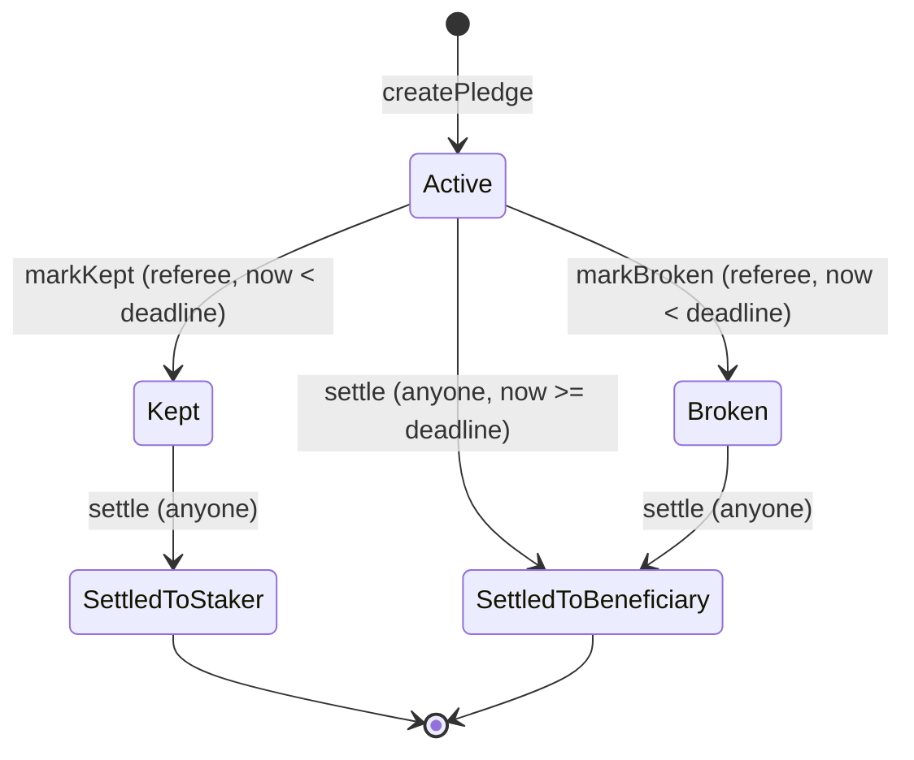

# 05 Low-Level Requirements

Version 1.29, 2026-10-09. Status: baselined. Low-level requirements are precise enough to be implemented and tested without further design decisions. Conventions follow 04_HLR.md. The "Derived" column marks requirements that arise from design or platform constraints rather than directly from a user journey; each carries its reason.

Scopes: **SC** smart contract, **FE** frontend application, **DP** deployment, **SB** submission, **VV** verification process.

---

## Part 1. Smart contract (`src/SatStake.sol`)

### 1.1 Normative interface

```solidity
enum Status { None, Active, Kept, Broken, SettledToStaker, SettledToBeneficiary }
enum PledgeState { Active, Expired, Kept, Broken, SettledToStaker, SettledToBeneficiary }

struct Pledge {
    address staker;
    address token;
    uint256 amount;
    address referee;
    address beneficiary;
    uint64  deadline;
    uint64  createdAt;
    Status  status;
    string  promiseText;
}

constructor(address[] memory tokens);

function createPledge(address token, uint256 amount, address referee, address beneficiary,
                      uint64 deadline, string calldata promiseText) external returns (uint256 id);
function markKept(uint256 id) external;
function markBroken(uint256 id) external;
function settle(uint256 id) external;

function getPledge(uint256 id) external view returns (Pledge memory);
function stateOf(uint256 id) external view returns (PledgeState);
function pledgeCount() external view returns (uint256);
function pledgeCountOf(address account) external view returns (uint256);
function pledgeIdsOf(address account, uint256 offset, uint256 limit) external view returns (uint256[] memory);
function isAllowedToken(address token) external view returns (bool);
function allowedTokens() external view returns (address[] memory);
function totalLocked(address token) external view returns (uint256);

uint64  public constant MIN_DURATION = 60;
uint64  public constant MAX_DURATION = 365 days;
uint256 public constant MAX_PROMISE_BYTES = 280;
uint256 public constant MAX_PAGE = 100;

event TokenAllowed(address indexed token);
event PledgeCreated(uint256 indexed id, address indexed staker, address indexed token, uint256 amount,
                    address referee, address beneficiary, uint64 deadline);
event VerdictRecorded(uint256 indexed id, bool kept);
event PledgeSettled(uint256 indexed id, address indexed recipient, uint256 amount);

error InvalidAllowlist();
error TokenNotAllowed(address token);
error ZeroAmount();
error ZeroAddress();
error PartyIsContract();
error PartyIsStaker();
error RefereeIsBeneficiary();
error DeadlineTooSoon(uint64 earliest);
error DeadlineTooFar(uint64 latest);
error PromiseEmpty();
error PromiseTooLong(uint256 length);
error UnexpectedTransferAmount(uint256 expected, uint256 received);
error PledgeNotFound(uint256 id);
error NotReferee();
error NotActive(Status status);
error VerdictWindowClosed(uint64 deadline);
error NotSettleable(uint64 deadline);
error AlreadySettled();
```

The OpenZeppelin units that LLR-SC-003 requires raise two further errors, which the contract does not declare but its ABI carries:

```solidity
error SafeERC20FailedOperation(address token);   // from SafeERC20
error ReentrancyGuardReentrantCall();            // from ReentrancyGuard
```

### 1.2 State machine


```mermaid
stateDiagram-v2
    [*] --> Active: createPledge
    Active --> Kept: markKept (referee, now < deadline)
    Active --> Broken: markBroken (referee, now < deadline)
    Active --> SettledToBeneficiary: settle (anyone, now >= deadline)
    Kept --> SettledToStaker: settle (anyone)
    Broken --> SettledToBeneficiary: settle (anyone)
    SettledToStaker --> [*]
    SettledToBeneficiary --> [*]
```

`Expired` is not a stored status. It is the derived view of a stored `Active` pledge whose deadline has been reached.

### 1.3 Requirements

**Build and structure**

| ID | Requirement | Parents | Method | Derived |
|---|---|---|---|---|
| LLR-SC-001 | The contract shall compile with Solidity 0.8.28 exactly, optimizer enabled at 200 runs, and `evm_version` set to the value confirmed in Phase 0 (default `cancun`). | HLR-018 | I | Yes: V-13 |
| LLR-SC-002 | The contract shall declare no `payable` function, no `receive`, and no `fallback`. | HLR-010 | T | Yes: D-01 removes native value handling |
| LLR-SC-003 | The contract shall use OpenZeppelin `SafeERC20` for every token transfer and shall apply OpenZeppelin `ReentrancyGuard.nonReentrant` to `createPledge`, `markKept`, `markBroken`, and `settle`. | HLR-015 | T, I | Yes: defense in depth; allowlisted tokens have no callbacks |
| LLR-SC-004 | Every revert the contract itself raises shall use a custom error declared in section 1.1; no revert strings shall be used. The two errors section 1.1 attributes to the OpenZeppelin units required by LLR-SC-003 may also reach a caller. | HLR-018 | I | Yes: gas and decodability |
| LLR-SC-005 | The contract shall declare `MIN_DURATION = 60`, `MAX_DURATION = 365 days`, `MAX_PROMISE_BYTES = 280`, and `MAX_PAGE = 100` as public constants. | HLR-018 | T | No |

**Data**

| ID | Requirement | Parents | Method | Derived |
|---|---|---|---|---|
| LLR-SC-010 | The contract shall store each pledge as a `Pledge` record with the fields in section 1.1. | HLR-001, HLR-013 | T | No |
| LLR-SC-011 | The contract shall represent stored pledge status with the `Status` enum in section 1.1, where `None` denotes a nonexistent pledge, and the derived state reported by `stateOf` with the `PledgeState` enum in section 1.1. | HLR-001, HLR-013 | T | No |
| LLR-SC-012 | The contract shall assign pledge identifiers sequentially starting at 1. | HLR-001 | T | No |

**Allowlist**

| ID | Requirement | Parents | Method | Derived |
|---|---|---|---|---|
| LLR-SC-013 | The constructor shall revert with `InvalidAllowlist` unless the `tokens` array has 1 to 4 entries, each non-zero, each an address with deployed code, and no duplicates. On success it shall record each token as allowed and emit `TokenAllowed` for each. | HLR-009 | T | No |
| LLR-SC-014 | The contract shall provide no function that adds, removes, or changes an allowed token after construction. | HLR-009, HLR-010 | T, I | No |

**Creation.** `createPledge` shall evaluate its checks in the order LLR-SC-021 to LLR-SC-026, reverting at the first failure.

| ID | Requirement | Parents | Method | Derived |
|---|---|---|---|---|
| LLR-SC-020 | `createPledge` shall, when all checks pass, create one pledge with `staker = msg.sender`, `createdAt = block.timestamp`, `status = Active`, and `token`, `amount`, `referee`, `beneficiary`, `deadline`, and `promiseText` taken unchanged from the arguments of the same name, and shall return its identifier. | HLR-001 | T | No |
| LLR-SC-021 | `createPledge` shall revert with `TokenNotAllowed(token)` if `token` is not allowed. | HLR-009 | T | No |
| LLR-SC-022 | `createPledge` shall revert with `ZeroAmount` if `amount` is 0. | HLR-001 | T | No |
| LLR-SC-023 | `createPledge` shall revert with `ZeroAddress` if `referee` or `beneficiary` is the zero address; then with `PartyIsContract` if either equals `address(this)`; then with `PartyIsStaker` if either equals `msg.sender`. | HLR-008 | T | No |
| LLR-SC-024 | `createPledge` shall revert with `RefereeIsBeneficiary` if `referee` equals `beneficiary`. | HLR-008 | T | No |
| LLR-SC-025 | `createPledge` shall revert with `DeadlineTooSoon(block.timestamp + MIN_DURATION)` if `deadline < block.timestamp + MIN_DURATION`, and with `DeadlineTooFar(block.timestamp + MAX_DURATION)` if `deadline > block.timestamp + MAX_DURATION`. | HLR-001 | T | No |
| LLR-SC-026 | `createPledge` shall revert with `PromiseEmpty` if `bytes(promiseText).length` is 0, and with `PromiseTooLong(length)` if it exceeds `MAX_PROMISE_BYTES`. | HLR-001 | T | No |
| LLR-SC-027 | `createPledge` shall transfer `amount` of `token` from `msg.sender` to the contract with `safeTransferFrom`, and shall revert with `UnexpectedTransferAmount(amount, received)` if the contract's balance of `token` did not increase by exactly `amount`, where `received` is the increase in that balance, or 0 if it did not rise. | HLR-001, HLR-002, HLR-012, HLR-015 | T | Yes: guards against fee-on-transfer behaviour a FiatToken upgrade could introduce |
| LLR-SC-028 | On success, `createPledge` shall increase `totalLocked(token)` by `amount` and append the new identifier to the pledge index of the staker, the referee, and the beneficiary. | HLR-001, HLR-002, HLR-015 | T | No |
| LLR-SC-029 | On success, `createPledge` shall emit `PledgeCreated` with the new pledge's identifier and fields. | HLR-001, HLR-016 | T | No |

**Verdict.** `markKept` and `markBroken` shall evaluate their checks in the order LLR-SC-030 to LLR-SC-032.

| ID | Requirement | Parents | Method | Derived |
|---|---|---|---|---|
| LLR-SC-030 | `markKept` and `markBroken` shall revert with `PledgeNotFound(id)` if the pledge's status is `None`, then with `NotReferee` if `msg.sender` is not the pledge's referee. | HLR-003 | T | No |
| LLR-SC-031 | `markKept` and `markBroken` shall revert with `NotActive(status)` if the pledge's status is not `Active`. | HLR-003 | T | No |
| LLR-SC-032 | `markKept` and `markBroken` shall revert with `VerdictWindowClosed(deadline)` if `block.timestamp >= deadline`. | HLR-003, HLR-017 | T | No |
| LLR-SC-033 | On success, `markKept` shall set status `Kept` and `markBroken` shall set status `Broken`, and each shall emit `VerdictRecorded(id, kept)`. | HLR-003, HLR-016 | T | No |

**Settlement**

| ID | Requirement | Parents | Method | Derived |
|---|---|---|---|---|
| LLR-SC-040 | `settle` shall be callable by any account and shall revert with `PledgeNotFound(id)` if the pledge's status is `None`. | HLR-005, HLR-006 | T | No |
| LLR-SC-041 | `settle` shall select the recipient by this table: status `Kept`: staker, new status `SettledToStaker`. Status `Broken`: beneficiary, new status `SettledToBeneficiary`. Status `Active` and `block.timestamp >= deadline`: beneficiary, new status `SettledToBeneficiary`. | HLR-004, HLR-005, HLR-006, HLR-017 | T | No |
| LLR-SC-042 | `settle` shall revert with `NotSettleable(deadline)` if status is `Active` and `block.timestamp < deadline`, and with `AlreadySettled` if status is `SettledToStaker` or `SettledToBeneficiary`. | HLR-005 | T | No |
| LLR-SC-043 | `settle` shall write the new status and decrease `totalLocked(token)` by the pledge amount before making the token transfer. | HLR-002, HLR-011 | T, I | Yes: checks-effects-interactions |
| LLR-SC-044 | `settle` shall transfer the full pledge amount to the recipient with `safeTransfer` and emit `PledgeSettled(id, recipient, amount)`. | HLR-005, HLR-016 | T | No |
| LLR-SC-045 | If a token transfer in `createPledge` or `settle` fails, the call shall revert entirely, leaving the pledge record, `totalLocked`, and all indexes unchanged. | HLR-012 | T | No |

**Views**

| ID | Requirement | Parents | Method | Derived |
|---|---|---|---|---|
| LLR-SC-050 | `getPledge(id)` shall return the stored record, and shall revert with `PledgeNotFound(id)` if `id` is 0 or greater than `pledgeCount()`. | HLR-013 | T | No |
| LLR-SC-051 | `stateOf(id)` shall return `Expired` if the stored status is `Active` and `block.timestamp >= deadline`, `Active` if the stored status is `Active` and `block.timestamp < deadline`, and otherwise the value matching the stored status. It shall revert with `PledgeNotFound(id)` for a nonexistent pledge. | HLR-004, HLR-013, HLR-017 | T | No |
| LLR-SC-052 | `pledgeCount()` shall return the number of pledges ever created. | HLR-013 | T | No |
| LLR-SC-053 | `pledgeCountOf(account)` shall return the length of the account's pledge index. `pledgeIdsOf(account, offset, limit)` shall return identifiers in creation order starting at `offset`, at most `min(limit, MAX_PAGE)` of them, and an empty array if `offset >= pledgeCountOf(account)`. | HLR-014 | T | Yes: paging bounds the cost of index flooding (UJ-64) |
| LLR-SC-054 | `isAllowedToken` shall report allowlist membership and `allowedTokens` shall return the constructor's token list in its original order. | HLR-009 | T | No |
| LLR-SC-055 | `totalLocked(token)` shall return the sum of amounts of the token's pledges whose status is `Active`, `Kept`, or `Broken`. | HLR-013 | T | No |

**Absence of power**

| ID | Requirement | Parents | Method | Derived |
|---|---|---|---|---|
| LLR-SC-060 | The contract shall contain no owner or admin state, no access control other than the referee check, no `selfdestruct`, no `delegatecall`, no proxy or upgrade mechanism, and no function that transfers tokens other than `createPledge` and `settle`. | HLR-007, HLR-010 | I, T | No |
| LLR-SC-061 | The contract's ABI shall contain exactly four non-view external functions: `createPledge`, `markKept`, `markBroken`, `settle`. | HLR-007, HLR-010 | T | No |

**Invariants.** Verified by stateful fuzzing across arbitrary sequences of calls and time jumps.

| ID | Requirement | Parents | Method | Derived |
|---|---|---|---|---|
| LLR-SC-070 | For each allowed token, `balanceOf(contract) >= totalLocked(token)` shall hold after every call. | HLR-015 | T | No |
| LLR-SC-071 | For each allowed token, `totalLocked(token)` shall equal the sum of amounts of that token's unsettled pledges after every call. | HLR-015 | T | No |
| LLR-SC-072 | A pledge's stored status shall change only along the edges of the diagram in section 1.2. | HLR-003, HLR-005 | T | No |
| LLR-SC-073 | Each pledge shall produce at most one `PledgeSettled` event, with recipient equal to its staker or its beneficiary and amount equal to its stake. | HLR-005 | T | No |
| LLR-SC-074 | After creation, a pledge's staker, token, amount, referee, beneficiary, deadline, createdAt, and promise shall never change. | HLR-007 | T | No |
| LLR-SC-075 | When a transfer to one pledge's recipient reverts, every other pledge shall remain creatable, verdict-able, and settleable as before. | HLR-011 | T | No |

**Documentation**

| ID | Requirement | Parents | Method | Derived |
|---|---|---|---|---|
| LLR-SC-080 | Every external function, event, and error that the contract declares shall carry NatSpec describing its behaviour and a `@custom:trace` tag listing the LLRs it implements. | HLR-018 | I | Yes: traceability |

---

## Part 2. Frontend application (`app/`)

### 2.1 Action matrix (normative for LLR-FE-042)

| Derived state | No wallet | Staker | Referee | Beneficiary | Other account |
|---|---|---|---|---|---|
| Active | "Connect a wallet to act" | none | "Kept" and "Broken" | none | none |
| Expired | "Connect a wallet to settle" | "Send payout" | "Send payout" | "Send payout" | "Send payout" |
| Kept | "Connect a wallet to settle" | "Send payout" | "Send payout" | "Send payout" | "Send payout" |
| Broken | "Connect a wallet to settle" | "Send payout" | "Send payout" | "Send payout" | "Send payout" |
| Settled to staker or beneficiary | none | none | none | none | none |

"Kept" and "Broken" are hidden once chain time reaches the deadline, even if the last poll still reported `Active`. All settle buttons call `settle(id)`, and the page says beside the button where the stake goes: to the staker when Kept, to the beneficiary when Broken or Expired. The labels are current wording; the actions per state and role are binding.

### 2.2 Error messages (current wording, not binding; LLR-FE-060 requires a message for each error)

| Error | Message |
|---|---|
| TokenNotAllowed | This token is not accepted. Choose cirBTC or USDC. |
| ZeroAmount | Enter an amount above zero. |
| ZeroAddress | Enter a valid address for the referee and the beneficiary. |
| PartyIsContract | The SatStake contract cannot be a party. Enter a person's address. |
| PartyIsStaker | You cannot be your own referee or beneficiary. |
| RefereeIsBeneficiary | The referee and the beneficiary must be different people. |
| DeadlineTooSoon | The deadline must be at least one minute from now. Pick a later time. |
| DeadlineTooFar | The deadline must be within one year. Pick an earlier time. |
| PromiseEmpty | Write the promise you are making. |
| PromiseTooLong | Shorten the promise to 280 bytes or fewer. |
| UnexpectedTransferAmount | The token transferred a different amount than expected, so nothing was locked. |
| PledgeNotFound | This promise does not exist. Check the link. |
| NotReferee | Only this promise's referee can record a verdict. |
| NotActive | A verdict has already been recorded for this promise. |
| VerdictWindowClosed | The deadline has passed, so a verdict can no longer be recorded. The stake now goes to the beneficiary. |
| NotSettleable | This promise cannot be settled until the referee rules or the deadline passes. |
| AlreadySettled | This promise has already been settled. |
| SafeERC20FailedOperation | The token refused the transfer. Nothing changed. You can try again later. |
| ReentrancyGuardReentrantCall | This request called SatStake again before the first call finished. Nothing changed. |
| Token revert on transfer | The token issuer blocked this transfer. Nothing changed. You can try again later. |
| Wallet rejection (4001) | You cancelled the request in your wallet. Nothing was sent. |

### 2.3 Requirements

**Configuration and network**

| ID | Requirement | Parents | Method | Derived |
|---|---|---|---|---|
| LLR-FE-001 | The application shall read, per build target, a network configuration containing: chain ID, network name, ordered RPC URL list, explorer base URL, SatStake contract address, example pledge ID, and for each token its address, symbol, and expected decimals. | HLR-030 | T | No |
| LLR-FE-002 | The build shall select `testnet` or `mainnet` configuration from an environment variable and shall fail if the selected configuration has no contract address. | HLR-030 | T | No |
| LLR-FE-003 | The application shall read chain data through a viem `fallback` transport over the configured RPC URLs in order. | HLR-029 | T | Yes: V-02 |
| LLR-FE-004 | The application shall retry a read that fails with JSON-RPC error `-32014`, an HTTP status of 429 or 500 to 599, or a network error (the request received no HTTP response) up to 3 times with delays of 250, 500, and 1000 ms. | HLR-029 | T | Yes: V-11 |
| LLR-FE-005 | On load, and again every 30 seconds while the page is visible, the application shall compare `eth_chainId` from the RPC with the configured chain ID. While the most recent comparison is a mismatch or received no answer, it shall disable all write actions and display a network error; once a later comparison matches, it shall clear both. | HLR-025, HLR-029 | T | No |
| LLR-FE-006 | On load, and again every 30 seconds while the page is visible, the application shall read `decimals()` and `symbol()` of each configured token. While the most recent read of a token returned values that differ from configuration (symbols compared exactly, including case) or could not be completed, the application shall disable pledge creation in that token and display a notice naming it. | HLR-026 | T | Yes: V-05, V-06 |

**Reading state**

| ID | Requirement | Parents | Method | Derived |
|---|---|---|---|---|
| LLR-FE-010 | The application shall obtain pledge data only from `getPledge`, `stateOf`, `pledgeCount`, `pledgeCountOf`, `pledgeIdsOf`, and `totalLocked`, and shall not call `eth_getLogs`. | HLR-023 | T, I | Yes: V-11 |
| LLR-FE-011 | While a pledge page is visible, the application shall re-read `stateOf` and the latest block every 4 seconds, and shall stop polling while the page is hidden. An answer shall never replace the result of a poll started after it. Until the first state is read, the page shall say that it is reading the pledge; while the most recent poll failed, it shall show an error beside the last state read. | HLR-023 | T | No |
| LLR-FE-012 | The application shall compute chain time as the latest block timestamp plus the local time elapsed since that block was fetched, re-synchronized on every poll, and shall use it for every countdown and every time-based control. | HLR-004, HLR-023 | T | Yes: V-10, UJ-25 |
| LLR-FE-013 | The application shall provide hash routes `#/`, `#/create`, `#/p/:id`, `#/mine`, and `#/about`, and shall show a not-found view for any other route or for a pledge ID the contract does not recognize. Every view shall offer navigation to the landing view, the create form, the connected account's list, and the about view, and shall name the configured network and link the source repository. | HLR-022 | T | Yes: D-07 |

**Wallet**

| ID | Requirement | Parents | Method | Derived |
|---|---|---|---|---|
| LLR-FE-020 | The application shall discover injected wallets using EIP-6963, and shall fall back to `window.ethereum` when no wallet announces itself. It shall list the wallets found, request account access only when the user picks one, and once connected show the account's address in shortened form. When no wallet is found, it shall say that a browser wallet is needed to act, and after a disconnect it shall say that no wallet is connected. While a request for account access is pending, or a connection remembered from an earlier visit is being confirmed, it shall say so, show no address, and send no second request. | HLR-025 | T | No |
| LLR-FE-021 | Without a connected wallet, the application shall render every read-only view fully. | HLR-025 | T | No |
| LLR-FE-022 | When the connected wallet is on another chain, the application shall say so and offer a control that requests `wallet_switchEthereumChain`; on error code 4902 it shall request `wallet_addEthereumChain` with the configured chain ID, network name, RPC URL list, and explorer URL, and USDC with 18 decimals as the native currency. While a switch request is pending, it shall send no second one. | HLR-025 | T | No |
| LLR-FE-023 | The application shall disable every write action unless a wallet is connected on the configured chain and the most recent LLR-FE-005 comparison matched, and shall say which of these conditions is unmet. | HLR-025 | T | No |

**Create flow**

| ID | Requirement | Parents | Method | Derived |
|---|---|---|---|---|
| LLR-FE-030 | The create form shall apply the checks of LLR-SC-021 to LLR-SC-026 locally (promise length measured in UTF-8 bytes, with the count shown against 280), plus address syntax and amount not above the staker's token balance. Because Arc pays network fees from the staker's USDC balance, a USDC amount shall leave at least 0.05 USDC of that balance, and a stake in any other token shall require a USDC balance of at least 0.05 USDC; both are read as ERC-20 balances. The form shall show the staker's balance of the selected token, and shall re-read a balance it could not read every 5 seconds, and every balance once each transaction from the form ends. It shall show each failure beside its field once the field has been left, or at once for a failure typing cannot fix (the token, an empty balance), and shall update a shown failure on every change. Submit shall stay disabled until all checks pass; it shall name what is still to complete, and activating it while disabled shall show every failure and move focus to the first field at fault. | HLR-008, HLR-021 | T | No |
| LLR-FE-031 | The deadline input shall offer presets of 2 minutes, 1 day, 7 days, and 30 days, plus a custom date and time, and shall reject a custom deadline earlier than chain time plus 90 seconds. A custom deadline shall be checked again against chain time when submit is activated and immediately before the `createPledge` request is sent; if it then fails, no `createPledge` request shall be sent and the failure shall show beside the deadline. If chain time cannot be read while a custom deadline is chosen, the form shall say so beside the deadline and retry every 5 seconds. A preset deadline shall be computed from chain time immediately before the `createPledge` request is sent, after any approval has confirmed; until then the form shall show its approximate end in local time. | HLR-021 | T | Yes: 30-second margin over MIN_DURATION absorbs inclusion delay; late computation stops approval time from consuming the preset |
| LLR-FE-032 | Amount entry shall accept only digits with at most one decimal point and no more fractional digits than the token's decimals, and shall convert with `parseUnits` using decimals from LLR-FE-006. The application shall never use the native balance or 18 decimals for a USDC stake. | HLR-026 | T | No |
| LLR-FE-033 | Before creation, the application shall read the staker's allowance; if it is below the amount, it shall request approval of exactly the amount, wait for its receipt, read the allowance again at the receipt's block, and request `createPledge` only if it covers the amount. Before the first prompt it shall say how many wallet prompts to expect, and it shall display numbered progress for both steps. Each receipt wait shall follow a transaction the wallet replaces and shall end after 3 minutes. If creation fails after an approval confirmed, the confirmed approval shall stay on screen with a statement that it remains in place, so trying again asks the wallet once. | HLR-001, HLR-021 | T | No |
| LLR-FE-034 | Submission shall require the staker to tick a statement that the referee alone decides the outcome and that a missed or broken promise pays the beneficiary address irrecoverably. The form shall also warn, beside the beneficiary field, that a stake sent to an address nobody controls is lost for good. | HLR-027 | T | No |
| LLR-FE-035 | The form shall warn, without blocking, when the referee or beneficiary address has deployed code, except code that is an EIP-7702 delegation designator (prefix `0xef0100`), which marks a person's account. | HLR-027 | T | No |
| LLR-FE-036 | While any transaction from the form is pending, the submit control shall be disabled and the form's fields read-only. | HLR-021 | T | No |
| LLR-FE-037 | After creation, the application shall decode `PledgeCreated` from the creation receipt and show, where the creation was made, the pledge ID, the creation transaction hash, a seal drawn only from that hash, a link to `#/p/:id`, and a copy-link control for it. | HLR-001, HLR-021 | T | No |

**Pledge page**

| ID | Requirement | Parents | Method | Derived |
|---|---|---|---|---|
| LLR-FE-040 | The pledge page shall display the promise, amount with symbol, the three parties labelled by role, the deadline in local time, a countdown while the pledge is Active or Expired, and the derived state. Every address and transaction hash shall have a copy control beside any explorer link. | HLR-022, HLR-029 | T | Yes: V-03 |
| LLR-FE-041 | The application shall mark the connected account's role (staker, referee, beneficiary) on the pledge page. | HLR-022 | T | No |
| LLR-FE-042 | The pledge page shall offer exactly the actions in section 2.1 for the current derived state and role. | HLR-022 | T | No |
| LLR-FE-043 | When a pledge is Active and less than 10 minutes of chain time remain, the page shall show a warning to the staker and the referee. | HLR-022 | T | No |
| LLR-FE-044 | "Broken" shall require a confirmation step, before any wallet request, stating that the stake will go to the beneficiary and that the verdict cannot be changed. | HLR-022 | T | No |
| LLR-FE-045 | Amounts shall be shown with the token's configured decimals and its symbol, and cirBTC amounts also in satoshis, including on the create form (the balance, and the amount once it is valid). No cirBTC amount shall be given a dollar value, and amounts in different tokens shall never be added together. | HLR-026 | T | No |
| LLR-FE-046 | A verdict or settle request from the pledge page shall disable every action control on the page from the moment it is made until it ends, show the transaction hash once the wallet returns it, and wait for the receipt as LLR-FE-033 does (following a transaction the wallet replaces, ending after 3 minutes). A confirmed receipt shall start a re-read of the pledge state at once and replace the activated control with a statement of the result. A revert, found before or after sending, shall show its section 2.2 message. If no receipt is obtained, the page shall say the transaction was sent and that the page shows the change once the network does, and shall offer the action again only as the polled state allows. | HLR-022, HLR-024 | T | No |

**Other views**

| ID | Requirement | Parents | Method | Derived |
|---|---|---|---|---|
| LLR-FE-050 | `#/mine` shall list the connected account's pledges newest first, 20 per page, each with its promise, amount with symbol, deadline, the account's role, and the derived state, and linking to its pledge page. Without a connected wallet it shall say that a wallet is needed to list pledges, and for an account with no pledges it shall say so and link to `#/create`. | HLR-014 | T | No |
| LLR-FE-060 | The application shall map every custom error in the contract ABI that a function other than the constructor can raise to a message that says what went wrong; section 2.2 holds the current wording, which is not binding. A test shall fail if any such error lacks a message. `InvalidAllowlist`, raised only by the constructor, is excluded, since no request from the application can produce it. | HLR-024 | T | No |
| LLR-FE-061 | A wallet rejection (code 4001) shall produce a neutral message that is not presented as an error. The message shall be removed when a new request starts or when the connection's state, account, or chain changes. | HLR-024 | T | No |
| LLR-FE-062 | Any other failure shall show a message saying that something went wrong and nothing was changed, with a control to copy the raw error, including each error it wraps and any numeric code; after the control is used, the application shall say whether the copy succeeded. The message shall be removed when a new request starts or when the connection's state, account, or chain changes. Once the wallet has returned a `createPledge` transaction hash, a failure to obtain its receipt shall instead say that the pledge was sent but its confirmation could not be read, and to check the account's list before trying again, with the hash and a link to `#/mine`, and shall offer no retry. That message is not removed by a change of connection, account, or chain; it stays until the page is left or reloaded. | HLR-024 | T | No |
| LLR-FE-070 | The landing view shall tell a visitor without a wallet what SatStake does and how, and shall show evidence that it is live on the configured network: the network name, the contract address in full with a copy control, links to its verified source on Sourcify and to the explorer, and the live `pledgeCount`. It shall offer a create call to action and a link to the configured example pledge. Any pledge it shows shall be read from the contract, never invented. | HLR-020 | I, D | No |
| LLR-FE-071 | `#/about` shall state the trust model and limitations of NS section 7. No user-facing string shall claim more than NS P7 allows: none shall contain the words "trustless", "guaranteed", "unstoppable", or "100% secure", except in a sentence that disclaims the claim, such as "SatStake doesn't claim to be trustless"; a test shall scan all strings and list each allowed disclaimer exactly. | HLR-027 | T, I | Yes: NS P7 |
| LLR-FE-072 | Layouts shall work from 360 to 1440 px wide; every control shall be keyboard reachable with a visible focus state, and a skip link shall be the first focusable element and move focus to the main heading; text contrast, and the contrast of the borders that mark controls, shall meet WCAG 2.1 AA, checked by inspection of the final styles. A route change after the first page load shall set the document title to name the view and move focus to its main heading; status changes shall be announced to assistive technology. When a control the user activated is removed because its request succeeded, focus shall move to the text that replaced it. | HLR-028 | I, D | No |
| LLR-FE-073 | The application shall load no third-party scripts, fonts, or analytics at runtime, and its Content-Security-Policy meta tag shall limit `connect-src` to the configured RPC URLs. It shall serve its own icon from its origin, and the policy shall allow images from that origin only. | HLR-035 | I, T | No |
| LLR-FE-074 | The application shall request from the wallet only account access (including `wallet_requestPermissions` for accounts and reading the accounts already shared), the wallet's current chain, network switch or add, and transaction sending; it shall never request a message or typed-data signature. | HLR-025 | I, T | Yes: limits what a compromised page could make a user sign |

**Build**

| ID | Requirement | Parents | Method | Derived |
|---|---|---|---|---|
| LLR-FE-080 | The application shall be built with Vite, React, TypeScript in strict mode, viem, and wagmi, with versions pinned by the lockfile, and shall pass ESLint with no `any` types. | HLR-030 | I | No |
| LLR-FE-081 | The application shall import the contract ABI from the Foundry build artifact at build time. | HLR-030 | I | Yes: prevents ABI drift |

---

## Part 3. Deployment (`script/`, `deployments/`)

| ID | Requirement | Parents | Method | Derived |
|---|---|---|---|---|
| LLR-DP-001 | `script/Deploy.s.sol` shall read the token allowlist from `deployments/config/<chainId>.json` and shall revert if `block.chainid` differs from the file's chain ID. | HLR-030 | T | No |
| LLR-DP-002 | Each token address in `deployments/config/5042.json` shall carry the URL of the official Circle or Arc page it was confirmed against and the confirmation date. | HLR-032 | I | Yes: V-06 |
| LLR-DP-003 | Deployments shall run through `forge script` with `--account <keystore>`; no command, script, or file shall pass a raw private key for mainnet. Keystore passwords may be supplied with `--password-file` pointing to a file outside the repository. | HLR-030 | I | Yes: V-12; password files let deployment run without Liam present |
| LLR-DP-004 | A post-deploy check shall confirm `allowedTokens()`, the four constants, `pledgeCount() == 0`, and each token's `decimals()`, and shall fail on any mismatch. | HLR-030 | T | No |
| LLR-DP-005 | `deployments/<chainId>.json` shall record contract address, deploy transaction hash, block number, git commit, compiler version and settings, and verification status. | HLR-032 | I | No |
| LLR-DP-006 | The contract shall be verified on Sourcify with a perfect match on each network it is deployed to. | HLR-031 | D | No |
| LLR-DP-007 | The Arc explorer shall show the mainnet contract as verified; if the Sourcify push does not appear, verification shall be completed through the explorer UI and recorded in the deployment file. | HLR-031 | D | Yes: V-04 |
| LLR-DP-008 | A GitHub Actions workflow shall build the mainnet application and publish it to GitHub Pages. | HLR-030 | D | No |
| LLR-DP-009 | `script/seed.mjs` shall create on mainnet, sending each transaction with `cast send` through the signer's keystore and approving exact amounts only: a cirBTC pledge marked kept and settled to the staker; a USDC pledge left to expire and settled to the beneficiary; a USDC pledge marked broken and settled to the beneficiary; and a cirBTC pledge with deadline 2026-11-01T00:00:00Z left Active. Total stake shall not exceed $5. It shall run in phases (create, verdicts, settle), each refusing unless the chain is Arc mainnet, the recorded address holds code whose `allowedTokens()` equals the config, and the pledges are in the state the phase expects. An interrupted create shall resume after the pledges that match the seed, approving only what the remaining pledges lock; an interrupted verdicts or settle shall skip each pledge already in that phase's end state and refuse any other unexpected state. Each phase shall stop with the transaction hash it has when a send fails after broadcast, and say how to rerun. A rehearsal mode, allowed only on Arc testnet and only with its own record, roles, and smaller amounts, shall run the same code so the send path is exercised on a real node before mainnet. | HLR-033 | D | No |
| LLR-DP-010 | The repository shall ignore keystores, `.env` files, and broadcast caches containing secrets, and CI shall run a secret scan that fails on any finding. | HLR-030 | T | No |
| LLR-DP-011 | A pre-commit hook shall run the same secret scan locally and block the commit on any finding. | HLR-030 | T | Yes: catches secrets before they reach history |
| LLR-DP-012 | Every mainnet transaction shall first be simulated against the live chain, by `forge script` without `--broadcast` or by `cast call` with the same sender and calldata, and shall be sent only if the simulation succeeds. A simulation shall not replace a contract the chain provides (a token or a precompile) with a local stand-in. | HLR-030 | I | Yes: crypto practice, no unsimulated mainnet transaction |

---

## Part 4. Submission

| ID | Requirement | Parents | Method | Derived |
|---|---|---|---|---|
| LLR-SB-001 | `README.md` shall contain, in order: the one-sentence description, the live link, contract address with Sourcify and explorer links, how it works with the state diagram, why Arc, trust model and limitations, the traceability summary, and local setup. | HLR-034 | I | No |
| LLR-SB-002 | The DoraHacks "what it does / what it uses Arc for" text shall be at most 150 words and shall contain no claim absent from the North Star. | HLR-034 | I | No |
| LLR-SB-003 | The demo video shall be at most 90 seconds and follow UJ-10, UJ-42, and UJ-40 in that order, showing the expired stake reaching the beneficiary. | HLR-034 | I | No |
| LLR-SB-004 | The repository shall be public under the MIT license. | HLR-034 | I | No |
| LLR-SB-005 | At submission, CI shall be green and the repository shall contain no TODO or FIXME markers in any case outside the specification documents `docs/0N_*.md`, which name them; no commented-out code; no `console.log` in shipped code, meaning the contract, the Solidity scripts, and `app/src`; and no unused dependencies. | HLR-034 | I, T | No |

---

## Part 5. Verification process

| ID | Requirement | Parents | Method | Derived |
|---|---|---|---|---|
| LLR-VV-001 | Code and tests shall carry trace tags as defined in 06_VERIFICATION_PLAN.md section 2. | HLR-040 | I | No |
| LLR-VV-002 | `tools/trace-check.mjs` shall fail CI under the conditions in 06_VERIFICATION_PLAN.md section 3 and shall regenerate `docs/TRACE_MATRIX.md`. | HLR-040 | T | No |
| LLR-VV-003 | `forge coverage` shall report 100% of lines, statements, branches, and functions for `src/SatStake.sol`; CI shall fail otherwise. | HLR-041 | T | No |
| LLR-VV-004 | Invariant tests for LLR-SC-070 to LLR-SC-075 shall run with at least 512 runs and depth 128. | HLR-041 | T | No |
| LLR-VV-005 | An end-to-end script shall execute UJ-10, UJ-11, UJ-30, UJ-31, UJ-32, UJ-40 to UJ-45 on Arc testnet with real tokens and record transaction hashes in `docs/evidence/`. | HLR-041 | T | Yes: V-08, anvil cannot reproduce Arc semantics |
| LLR-VV-006 | Frontend unit tests shall cover LLR-FE-012, 030, 031, 032, 042, 045, 060, and 071. | HLR-041 | T | No |
| LLR-VV-007 | Unit tests shall use a mock token that implements FiatToken-style blocklisting and pausing to verify LLR-SC-045 and LLR-SC-075, a second mock token that charges a fee on transfer to verify LLR-SC-027, and a third mock token that reenters the contract from a transfer, that can return `false` or no value, and that can take an account's balance during a transfer, to verify LLR-SC-003 and the falling-balance case of LLR-SC-027. | HLR-041 | T | Yes: issuer controls cannot be triggered on real tokens |
| LLR-VV-008 | Slither shall run on the contract; every finding shall be fixed or justified in `docs/evidence/slither.md`, with no unresolved high or medium finding. | HLR-041 | A | Yes: static analysis as independent check |
| LLR-VV-009 | `docs/ACCEPTANCE.md` shall list every journey in 03_USER_JOURNEYS.md with its expected outcome, its verification (test names, evidence file, or walkthrough step), and its result; `tools/trace-check.mjs` shall fail if any journey is missing or, with `--release`, has a result other than `Pass`, except that a journey whose verification includes a walkthrough step may have the result `Awaiting walkthrough`. | HLR-042 | T | No |
| LLR-VV-010 | `docs/WALKTHROUGH.md` shall give Liam a numbered end-user script on the mainnet site covering every journey marked for manual verification in ACCEPTANCE.md, with the expected result of each step. | HLR-042 | D | No |
| LLR-VV-011 | For each LLR group, before the implementing code is written, `docs/evidence/tdd-log.md` shall record the new tests and their observed failure output; after implementation it shall record the same tests passing. | HLR-043 | I | Yes: makes test-first observable without tying it to commit cadence |

## Change log

| Version | Date | Change |
|---|---|---|
| 1.0 | 2026-09-24 | Baseline |
| 1.1 | 2026-09-24 | Added LLR-VV-009 to 011; LLR-FE-031 preset timing; LLR-DP-003 password files |
| 1.2 | 2026-09-24 | LLR-VV-011 records test-first evidence in a log instead of commit history, per Liam's commit preference |
| 1.3 | 2026-09-24 | Added LLR-DP-011, 012 and LLR-FE-074 for security |
| 1.4 | 2026-09-25 | LLR-VV-009 accepts `Awaiting walkthrough` at release for journeys with a walkthrough step. Found by independent review: 06 section 11 runs `trace-check --release` before Liam's walkthrough, so requiring `Pass` for every journey made the gate impossible to open. |
| 1.5 | 2026-09-25 | Section 1.1 and LLR-SC-026: the field and parameter `promise` renamed `promiseText`, because `promise` is a reserved keyword in Solidity 0.8.28 (error 2314) and the interface could not compile. LLR-SC-011 now also covers the `PledgeState` enum, which section 1.1 declares but no requirement other than LLR-SC-051 named. Both found by the implementer of the first contract group. |
| 1.6 | 2026-09-26 | LLR-VV-007 names the fee-charging mock that 06 section 5 already required for LLR-SC-027, so the mock traces to a requirement and not only to the plan. |
| 1.7 | 2026-09-27 | LLR-VV-007 names a third mock, hostile on transfer. LLR-SC-003 has method T, but the guard it requires cannot be shown to be applied without a token that reenters, and the `SafeERC20` half cannot be shown without a token that returns `false` or no value. Found when scoping the create group. 06 section 5 changed to match. |
| 1.8 | 2026-09-27 | LLR-SC-020 now states that `token`, `amount`, `referee`, `beneficiary`, `deadline`, and `promiseText` are stored unchanged from the arguments. It named only the three fields the contract derives, so nothing required the stake to record what the staker actually asked for; LLR-SC-010 gives the record its shape, not its values. Found by the implementer of the create group. |
| 1.9 | 2026-09-27 | Three changes from the independent review of the create group. Section 1.1, LLR-SC-004, and section 2.2: `SafeERC20` and `ReentrancyGuard`, which LLR-SC-003 requires, put `SafeERC20FailedOperation` and `ReentrancyGuardReentrantCall` in the ABI, so LLR-SC-004 as written was false the moment LLR-SC-003 was met, and LLR-FE-060 would have failed on two unmapped errors. Both are now declared and given messages. LLR-SC-027 defines `received` as 0 when the balance does not rise, which the code had decided on its own. LLR-VV-007 covers the mock taking a balance during a transfer, which is what reaches that case. |
| 1.10 | 2026-10-01 | Three changes from the independent review of the "FE configuration and reading" group. LLR-FE-004 retries HTTP 429 and 5xx answers and defines a network error as no HTTP response: mainnet has one configured RPC, so a load balancer's 503 was never retried, against UJ-90. LLR-FE-005 and LLR-FE-006 check again every 30 seconds while the page is visible, and treat an unanswered check as a failure: checked only on load, one failed request disabled writes for the whole session and a recovered RPC never re-enabled them, against HLR-029, and a check that never answered left the outcome undefined. LLR-FE-006 also names the comparison (exact, case-sensitive) and requires a visible notice, which the frontend review found missing. |
| 1.11 | 2026-10-02 | From the confirmation reviews of the "FE configuration and reading" group, which found behaviour in the code that no requirement asked for. LLR-FE-011 states the ordering of poll answers, which the first review found missing, and what the page shows before the first answer and after a failed poll: the frontend review found a failing read left "reading" on screen forever, or a stale state shown as current near a deadline. LLR-FE-013 requires the shared header and footer that make the routes reachable. LLR-FE-072 requires title and focus handling on route changes and announced status changes, which keyboard and screen-reader use depend on; the first page load is excluded so focus does not skip the navigation. |
| 1.12 | 2026-10-02 | LLR-FE-073 requires the site's own icon and an `img-src` limited to the site's origin. Without an icon, every browser requests `/favicon.ico` on load, which a `default-src 'none'` policy reports as a violation. The second confirmation review found the icon in the code with no requirement asking for it. |
| 1.13 | 2026-10-02 | Before the "FE wallet" group, three wallet requirements made precise against UJ-02 and UJ-03. LLR-FE-020 says when the `window.ethereum` fallback applies, that account access waits for the user to pick a wallet (HLR-025 "connect on user request"), and what is shown connected and with no wallet; none of this had a requirement. LLR-FE-022 read as an automatic switch prompt on connect, while UJ-03 offers a control the user may decline, and "the configured parameters" did not say which; wagmi sends only the first RPC URL unless given the list. LLR-FE-023 now names the most recent comparison, as LLR-FE-005 has re-checked every 30 seconds since 1.10, and requires the visible reason UJ-03 asks for when writes stay disabled. |
| 1.14 | 2026-10-02 | From the two reviews of the "FE wallet" group, which found wallet behaviour in the code that no requirement asked for, and gaps a screen-reader or keyboard user would hit. LLR-FE-020 covers a pending or remembered connection: without it a second click sent a second prompt, which MetaMask refuses with an error. LLR-FE-022 does the same for the switch. LLR-FE-062 names what the raw error contains and requires a confirmation after copying, since a clipboard write has no visible effect. LLR-FE-072 adds the contrast of control borders (WCAG 1.4.11, also AA), measured at 1.67 to 1 on buttons, and moves focus when a successful request removes the control that had it, which otherwise drops focus to the page body. LLR-FE-074 names reading shared accounts and the current chain, which every injected connector does and the old text did not list. LLR-FE-061 and 062 say when their message is removed: on a new request, or when the connection changes, so a refusal is not left on screen after the user switches in the wallet; the confirmation review found the code clearing it with no text asking for that. |
| 1.15 | 2026-10-02 | From the two reviews of the "FE create" group. LLR-FE-062: once `createPledge` has a hash, a failed receipt read said "Nothing was changed" and re-enabled submit, inviting a second pledge on a single-RPC mainnet; that case now has its own message and no retry. LLR-FE-033: the receipt wait was unbounded and blind to a wallet's speed-up or cancel, and a creation failing after a confirmed approval hid the approval; both are stated. LLR-FE-030: on Arc ERC-20 USDC and the gas balance are one balance, so a stake of the whole USDC balance, or a cirBTC stake with no USDC, could not pay its fees; it also states when a failure appears, the shown balance, the byte count, and what a disabled submit says and does, all of which the code did with no requirement. LLR-FE-031: a custom deadline judged only at the last render could expire during approval and reach the contract; it is re-checked at submit and before `createPledge`. LLR-FE-036: fields are read-only while a request is pending, so the screen cannot differ from what is sent. LLR-FE-045 names the create form, since UJ-10 expects sats there. LLR-FE-060 excludes `InvalidAllowlist`, which only the constructor raises. |
| 1.16 | 2026-10-03 | LLR-FE-062: the confirmation review of the "FE create" fixes found the unconfirmed-creation message removed by the connection rule written for the general message, so a wallet that locked itself or a switch of account and back brought submit back with the form filled, and one click could lock a second stake. The message now stays until the page is left or reloaded. |
| 1.17 | 2026-10-03 | From the design brief for the "FE pledge page and other views" group (`docs/BRIEF_PLEDGE_AND_VIEWS.md`), written before any code. LLR-FE-046 is new: LLR-FE-033 and 036 cover the pending, receipt, and failure handling of the create form only, so a verdict or settle request had no requirement for disabling its controls while pending, showing its hash (which LLR-FE-040 and UJ-92 need a copy control for), a bounded receipt wait, refreshing the state, or what follows an unconfirmed transaction. A second verdict or settle is refused by the contract with a section 2.2 message, so unlike creation it may be offered again. LLR-FE-050 names what each listed pledge shows and what the view says with no wallet or no pledges; a list of identifiers with a role and a state does not let a person find a pledge, and the two empty cases had no text. Section 2.2: the `SafeERC20FailedOperation` message said "nothing was locked", which is true of creation only; `settle` also raises it through `safeTransfer`, so the message now says nothing changed. |
| 1.18 | 2026-10-03 | From the requirements review of the "FE pledge page and other views" group. LLR-FE-040 shows the countdown only while the pledge is Active or Expired. Once a verdict is recorded nothing waits on time, and a running "2 days left" beside a Kept pledge read as something still pending (frontend review of the design brief); the code and brief already did this, so the text now matches. |
| 1.19 | 2026-10-03 | From the pre-release sweep. LLR-FE-031 said a failed chain-time read is always said, but only a custom deadline is judged against chain time on the form; a preset is computed from a fresh read just before `createPledge`, and a failure there is reported by LLR-FE-062. The sentence is narrowed to what a person needs to act on, which is also what the code does. |
| 1.20 | 2026-10-03 | The pre-release sweep fixed six findings with behaviour no sentence asked for, so the text now does. LLR-FE-020: "No wallet connected." after a disconnect, which was announced by nothing. LLR-FE-030: balances are re-read once each transaction ends, since the fee-reserve check ran against a stale USDC balance after an approval. LLR-FE-031: a preset shows its approximate end, which a staker otherwise could not see before signing. LLR-FE-033: the allowance is read again after the approval, at the receipt's block, because a wallet that cancels a pending approval returns the cancel's successful receipt, and an endpoint one block behind (01 V-11) would return the old allowance with no error. LLR-FE-035: an EIP-7702 delegated account is a person's wallet, not a contract. LLR-FE-072: a skip link, since the wallet bar adds tab stops before the main content. |
| 1.21 | 2026-10-03 | LLR-DP-009 and 012, from the code part of the mainnet group. Arc's USDC moves value through system precompiles that Foundry 1.0.0 does not implement, so `forge script` cannot simulate any USDC transfer: a seed written as `Seed.s.sol` would have to skip the simulation and run against local stand-ins of the precompiles, with gas limits taken from the stand-in rather than from Arc. A transaction simulated against a fake is not simulated, and a gas limit too low for the real precompile would revert on mainnet and lose its fee. The seed is therefore a Node script that simulates each transaction with `cast call` against the live chain, which runs the real precompiles, and sends it with `cast send` and the keystore, with gas estimated by Arc (01 V-05, V-11). LLR-DP-012 now says what counts as a simulation; the contract deployment moves no USDC and still simulates with `forge script`. The phases and state checks were in the design with no sentence asking for them. |
| 1.22 | 2026-10-03 | LLR-FE-074 names `wallet_requestPermissions`. The live UI dry run on testnet saw wagmi's injected connector send it on connect, beside `eth_requestAccounts`. It asks the wallet for account access, which the requirement already allows, and it is not a signature; the list now names it so the inspection can be checked against what the wallet actually receives. |
| 1.23 | 2026-10-03 | LLR-DP-009, from the independent review of the mainnet group. A create interrupted after its first pledge (a failed send on the single mainnet RPC) could never be finished, since the phase refused any contract that was not empty. An approval could be sent to a wrong record address, since an `approve` simulates fine against any spender. And the send path had run only against a test double, the lesson of `verify-sourcify.mjs` (2026-09-30); the testnet rehearsal is what found it sound. |
| 1.24 | 2026-10-04 | LLR-DP-009, from the confirmation review of the mainnet group. Only `create` could resume: a verdicts run stopped after `markKept 1` by a failed send on the single mainnet RPC refused on rerun because pledge 1 was no longer Active, and settle then refused for good; the same for settle after `settle 1`. The only recovery was a hand-typed `cast send` outside the simulate-then-send path of LLR-DP-012. Each phase now skips a pledge it already finished. A send that fails after broadcast now reports its hash, since a rerun before it is mined could create a second pledge. |
| 1.25 | 2026-10-04 | Two changes from the independent review of the release-gate batch. LLR-SC-080 now covers what the contract declares. `SafeERC20FailedOperation` and `ReentrancyGuardReentrantCall` are in the ABI because of LLR-SC-003, but they are declared in the pinned OpenZeppelin libraries, where no annotation can be added; section 1.1 already says the contract does not declare them, and LLR-SC-004 was reworded for the same reason in v1.9. LLR-SB-005 states the scope its test applies: the specification documents must name the markers to require their absence, and the command-line tools and the invariant harness print to the terminal by design, so `console.log` is ruled out of shipped code only. Markers are matched in any case, which the review found the test did not do. |
| 1.26 | 2026-10-07 | From the landing and app structure brief, version 2 (`docs/BRIEF_LANDING.md`), and the dark aesthetic Liam approved on 2026-10-06. The home page explained the contract, not the product: a visitor could not say what SatStake is for, against NS 9's ten-second test. LLR-FE-070 now describes the landing page: a heading in plain words, a card of recent promises read from the contract (never invented, with the pause control WCAG 2.2.2 asks of anything that moves on its own for more than five seconds), the worked example with its three endings, the trust claims beside their limits, a reviewer strip, and questions; the NS section 1 sentence moves to the footer, where the Pages check still finds it. LLR-FE-013 splits the landing and app headers. LLR-FE-040 puts a banner by role and state above the promise, because referees and beneficiaries meet SatStake first on a shared link, and labels the parties by what they do. LLR-FE-045 writes USDC in dollars and cirBTC in sats with a one-line hint, and forbids adding the two tokens, which would need a price feed (NS 8). LLR-FE-050 groups My promises by what needs this account, so a referee sees a pending verdict first; entries link to the pledge page rather than repeating its actions. LLR-FE-034 shows the irrecoverability warning beside the beneficiary field, where the mistake is made (NS 7). LLR-FE-037 leads with sharing, since SatStake sends no messages and an unshared promise expires to the beneficiary. LLR-FE-071 makes "promise" the user-facing word; section 2.2 and LLR-FE-062 follow. LLR-FE-072 fixes one dark theme in place of following the system setting: the approved design is dark only, and a second theme built late would be the weaker one; AA contrast still applies. |
| 1.27 | 2026-10-08 | Liam owns the look and the words of the application from here on, and will change both heavily; the frontend requirements now bind only what a pledge, a person's money, security, and honesty depend on. Released: the exact texts of section 2.2 and LLR-FE-061 and 062 (each error still needs a message that says what went wrong); the landing page's structure, heading, and quotation of NS section 1 (LLR-FE-070 keeps the evidence that it is live and the rule that no pledge shown is invented); the header and footer composition (LLR-FE-013 keeps the routes and navigation); the dark theme and every colour, font, and layout detail (LLR-FE-072 keeps keyboard access, focus, the skip link, 360 to 1440 px, announcements, and AA contrast, now checked by inspection of the final styles instead of tests that pinned each colour); the em dash and the words "seamless" and "revolutionary" (LLR-FE-071 keeps the four words that would claim more than NS P7 allows). LLR-FE-037, 040, and 050 return to their v1.25 text, since v1.26 added only wording and layout to them. LLR-FE-045 keeps correct units and the ban on dollar values and cross-token totals, which would need a price feed (NS 8), and drops the exact format. LLR-FE-034 keeps the beneficiary warning, a safety rule, with its words free. The tests that pinned released wording or style are removed or narrowed in the same change, recorded in the TDD log, as section 10 of the verification plan asks. |
| 1.28 | 2026-10-09 | Liam adopts a new design, "Signed" (`design/satstake-signed-frontend.html`), for the whole frontend. Three rows follow it. LLR-FE-037: the creation happens in the landing hero and ends there, on the promise's number, its transaction hash, a seal drawn from that hash, and the share link, instead of moving to the promise page; the signature on the pad is an animation, and the application takes no drawing input. LLR-FE-044: Broken is confirmed inline in the agreement, so "dialog" becomes "confirmation step", still before any wallet request. LLR-FE-071: the trust section says "SatStake doesn't claim to be trustless", a disclaimer of the very claim the rule forbids; the scan now allows listed disclaimers word for word and still refuses the claim. |
| 1.29 | 2026-10-09 | Section 2.1: every settle button reads "Send payout", Liam's wording in the Signed design, with the destination said beside it. Which actions appear for which state and role is unchanged and stays binding; the labels are marked as current wording, as section 2.2 already is. |
